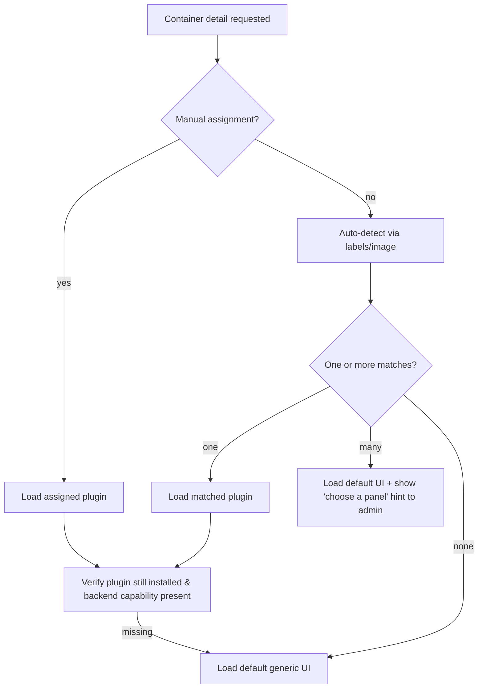

# The Question

The current workspace is a repository for a project similar to Yacht and Portainer. The scope is to have an application to manage Containers on a remote server (or in your local machine) with a non tech user friendly interface. The thought that started the development was: "I have non tech friends who want to play video games togheter and this requires a server, I have a server but they are not tech people so I can't teach them how to use ssh to connect to the server and teach them how to use docker CLI to start and stop servers containers, they could even accidentally make a big mess so i want a non tech user friendly interface to help them start and stop servers without ever writing a single line of code in the console" so i created this project (which is not even at version 1.0), it currently works pretty damn good but i want you to help me brainstorm a potential architectural change and big feature I was thinking about:

The application can show you lots of containers, for games and not only (for example I can manage my apps), but for games especially I was thinking, why have the same Interface for each containers even for the gaming ones? Why not have specific container interfaces for different types of games? For example, for a Minecraft Server I can show an interface similar to the Aternos one, for VRising another type, for Satisfactory another one too and so on.. If a game has no corresponding specific UI then the default (the one common to every container) is used, otherwise show the custom one. 

The feature is:
I was thinking of creating a "Plugin" system to let any developer to create custom UIs for each type of component they want an load them to their application instance since the repository is public and is thought to be used by anyone.

Here are some concerns:
- Can multiple types of UIs exist for a single type of container (for example 3 different types of UIs for a minecraft server and the user choses one of them)?
- Shall the UI automatically recognise the container or maybe the default UI is used at container creation and the Admin user (the only one who can create and destroy containers for now) chooses the UI for each container and that information remains saved?
- How do i create the plugin system for the frontend? 
- Should I add informations (columns) to the database to make the plugin work?
- Should the plugin be only a frontend piece or should it also alter the backend? The user installs it in their own server instance so they have full access to it and also the repository is public, the user could fork it, change it, build it and deploy its own version so the developer user has maximum trus.

Act as an expert fullstack developer in Angular 21+, ASP .NET 10, SQLite and Plugin systems, help me brainstorm the idea and guide me through the process of finding a solution or abandoning the idea if it is not achievable.

For context:
- Backend is in ASP .NET 10
- Frontend is in Angular 21+
- Database is currently in SQLite
- ORM is EF Core
- Everything runs inside only one container
- The Angular files are statically served from the backend app

Ask any questions you need to achieve at least 95% of context comprehension

# The Answer

I'll explore the codebase structure to ground my questions in your actual architecture, then ask targeted clarifying questions.   

Searched codebase for "container entity model type game minecraft definition", 31 results

Read 

Read 

Let me look at the frontend app structure, routing, and how container detail views are currently rendered.   

Read 

Read 

Searched for files matching `**/*.routes.ts`, 5 matches

Read 

Read 

Read , lines 1 to 120

I now have a solid grasp of your architecture:

- **Backend**: ASP.NET 10, DDD layering (Domain/Application/API), CQRS-style commands/queries, EF Core + SQLite, ASP.NET Identity with role policies (confirmed admin vs. confirmed user), `Container` entity carrying `Labels`, `Ports`, `State`, `Namespaces`.
- **Frontend**: Angular 21+ in an Nx monorepo, standalone components, lazy-loaded feature routes (`@scm/containers/features`, etc.), zod-validated DTOs, served statically from the backend `wwwroot` in production.
- **Deployment**: single container, Angular built and statically served by the backend.

Before I lay out an architecture, a few answers will materially change the recommendation (they push toward very different designs). Let me ask the highest-leverage ones. 

Analyzing your answers...

Great — that gives me what I need. Here's a structured brainstorm built around your answers: **hybrid loading**, **optional backend per plugin**, **auto-detect + admin override**, **admin-selected UI persisted per container**, **single-operator full-trust**, and you want **2–3 approaches with tradeoffs**.

## 1. Verdict up front: it's achievable, and it fits your stack well

The feature is a good fit because your architecture already has the right seams:

- Frontend is Nx with **lazy-loaded, standalone components** behind route boundaries — that is exactly the shape a plugin system needs.
- Backend is **layered + CQRS**, so "plugin backend capabilities" can be modeled as additional command/query handlers without polluting the core `Container` domain.
- Full-trust, single-operator model means you can **skip the hardest 40% of the work** (sandboxing, code review, capability isolation) and add it later only if you open a public registry.

The key mental shift: don't think "plugin = a screen." Think **"plugin = a contribution that answers: _for this container type, what UI (and optionally what backend capabilities) do I provide?_"** Everything below is about making that contract stable so build-time and runtime plugins are interchangeable.

## 2. The one design decision that de-risks everything: a stable contract

Whatever delivery mechanism you pick (compiled-in, Web Component, federation), define a **single frontend plugin contract** now. If build-time and runtime plugins both implement the same interface, you can start compiled-in and switch to dynamic later **without touching the host app**. This is the concrete meaning of your "hybrid" answer.

```ts
// @scm/plugins/contract  (a tiny lib with NO framework-heavy deps)
export interface ContainerPluginManifest {
  id: string;                 // 'scm.minecraft.aternos-like'
  displayName: string;        // shown to admin in the picker
  version: string;            // semver
  // How this plugin decides it *can* handle a container (auto-detect):
  match: {
    images?: string[];        // e.g. ['itzg/minecraft-server']
    labels?: Record<string, string>; // e.g. { 'scm.game': 'minecraft' }
  };
  // Optional backend requirement:
  requiresBackend?: { capabilityId: string; minVersion: string };
}

export interface ContainerPlugin {
  manifest: ContainerPluginManifest;
  // Returns the standalone component to render in the container detail area.
  loadComponent(): Promise<Type<unknown>>;
}
```

The host renders any plugin the same way — via `ViewContainerRef.createComponent()` or a dynamic `NgComponentOutlet` — and passes the container context (id, image, labels, ports, state) through a well-defined input token. That input contract is your real API surface; guard it with zod just like your existing DTOs.

## 3. Frontend delivery — three approaches, with tradeoffs

### Approach A — Build-time Nx libraries + a registry (compiled in)
Each plugin is an Nx lib (`libs/plugins/minecraft-aternos/`) exporting a `ContainerPlugin`. A generated registry array is imported by the host; the component is still **lazy-loaded** via `loadComponent()` so it's a separate chunk.

- ✅ Simplest; full type safety; shares your design system, DI, auth interceptors, zod, i18n for free.
- ✅ Best DX and debugging; no version-skew between host Angular and plugin Angular.
- ❌ Adding/updating a plugin requires rebuild + redeploy of the single container.
- ❌ Third parties must fork/PR — no drop-in install.
- **Best for:** your v1. Ships fastest, proves the UX, and validates the contract.

### Approach B — Runtime Web Components (`@angular/elements` / custom elements)
Plugins are built as **self-contained custom elements** (`<scm-minecraft-panel>`) into standalone JS bundles. The host loads the bundle with a dynamic `import(/* @vite-ignore */ url)` at runtime and renders the element, passing container context via attributes/properties and receiving events via `CustomEvent`.

- ✅ True drop-in install with **no host rebuild** (matches your "evolve to runtime" goal).
- ✅ Framework-agnostic — a plugin author could even use React/Svelte.
- ✅ Strong isolation boundary (the DOM element), which is nice even under full trust.
- ❌ You lose seamless Angular DI sharing — the plugin can't easily reuse your `HttpClient` interceptors, auth, or design system unless you expose them explicitly (e.g. via a small injected "host bridge" object on the element).
- ❌ Each bundle ships its own framework runtime → larger payloads (mitigable with import maps / shared deps).
- ❌ Communication is string/serializable-only across the element boundary — plan the event contract carefully.
- **Best for:** the runtime phase, especially if you want non-Angular authors.

### Approach C — Runtime **Native Federation** (module federation for esbuild/Vite)
Angular 21 uses the esbuild/Vite application builder, so classic Webpack Module Federation is out; the modern equivalent is **Native Federation** (`@angular-architects/native-federation`). The host is a "shell" that loads remote-exposed standalone components at runtime and — critically — **shares the Angular runtime, RxJS, and your `@scm/*` design libs** via import maps.

- ✅ Runtime install **and** full Angular DI/design-system sharing (best of both).
- ✅ No duplicated framework per plugin; smaller bundles than Web Components.
- ✅ Plugin components feel native to the app (same theming, same `HttpClient`).
- ❌ Most operational complexity: version alignment of shared singletons, remote manifests, build config per plugin.
- ❌ Tighter coupling to Angular versions across host and remotes (skew can break things).
- **Best for:** the mature runtime phase if all plugins are Angular and you want them to feel first-class.

### My frontend recommendation for the hybrid path
Phase 1: **Approach A** with the contract from §2. Phase 2: add a loader that can also resolve plugins via **Approach B (Web Components)** for drop-in installs, keeping A for your first-party ones. Only reach for **C** if you find Web Components' lost DI/theming sharing too painful and all authors are on Angular. The contract makes A→B→C additive, not a rewrite.

## 4. Backend — "optional backend per plugin"

Two viable models, and you can support both:

### B1 — Generic capabilities (no plugin code in backend)
Extend the core with a small set of **generic, reusable container capabilities** the frontend plugins call: exec/RCON passthrough, log streaming, read/write a whitelisted config file, list files in a volume. A Minecraft plugin then needs *zero* backend code — it just composes generic endpoints (RCON `list`, edit `server.properties`).

- ✅ No dynamic assembly loading, no new attack surface, no versioning of native code.
- ✅ Covers a surprising share of game panels (RCON + config file + logs handles Minecraft, VRising, Satisfactory largely).
- ❌ Some game-specific logic (parsing, scheduling backups) leaks into the frontend or isn't possible.
- **Recommendation:** build this first regardless — it's high-value and safe.

### B2 — Backend plugin assemblies (dynamic .NET load)
For plugins that genuinely need server logic, load .NET plugin assemblies at startup from a `plugins/` folder using a dedicated `AssemblyLoadContext`, and let each register its own command/query handlers + minimal-API endpoints under a namespaced route (`/api/plugins/{capabilityId}/...`). Define a backend contract mirroring the frontend one:

```csharp
public interface IContainerBackendPlugin
{
    string CapabilityId { get; }      // matches manifest.requiresBackend.capabilityId
    string Version { get; }
    void RegisterServices(IServiceCollection services);
    void MapEndpoints(IEndpointRouteBuilder endpoints); // routed under /api/plugins/{CapabilityId}
}
```

- ✅ Full power; game-specific server logic lives in the plugin.
- ❌ Dynamic assembly loading in a single-container, full-trust app = the plugin runs with your app's full privileges (DB, Docker socket). Acceptable under your trust model, but document it loudly.
- ❌ `AssemblyLoadContext` unload/version-skew is fiddly; simplest is "load at startup, restart to change" (which pairs naturally with your build-time phase).
- **Recommendation:** defer to Phase 2/3, gated behind `requiresBackend`. Most plugins won't need it if B1 exists.

## 5. Data model changes (small and additive)

You need to persist the admin's choice and support auto-detect + override. Minimal EF Core additions to `Container` (or a side table to keep the domain clean):

- `AssignedPluginId` (nullable string) — the admin's chosen plugin; null ⇒ use default/auto-detected UI.
- `PluginSelectionMode` (enum: `Auto` | `Manual`) — so an explicit "use default" choice is distinguishable from "never chosen."
- Optionally cache `DetectedGameType` (nullable string) for fast listing/filtering.

Auto-detect itself needs **no schema** — it's computed from the existing `Labels` and the container image at query time. A convention like a `scm.game=minecraft` Docker label (which you already store) is the cleanest detection signal, with image-name matching as fallback. I'd model the choice as a small owned value object or a dedicated `ContainerPluginAssignment` table rather than scattering columns, to keep `Container` focused.

The resolution flow the frontend/back should agree on:



Note the **fallback guard** (`I`): a persisted `AssignedPluginId` can point to a plugin that was later uninstalled — always degrade gracefully to the default UI.

## 6. Multiple UIs per type + selection (your chosen behavior)

- On creation → default/generic UI, `PluginSelectionMode = Auto`.
- Admin opens container settings → sees a **picker** listing all installed plugins whose `manifest.match` fits (plus "Default"). Choosing one sets `AssignedPluginId` + `Mode = Manual`.
- Non-admins just see whatever is assigned — no picker. This maps cleanly onto your existing `ConfirmedAdminPolicy` vs `ConfirmedUserPolicy`.
- Endpoint sketch: `GET /api/containers/{id}/available-plugins` (admin) and `PUT /api/containers/{id}/plugin` (admin), both new thin commands/queries alongside your current container ones.

## 7. Security notes (even under full trust)

Full-trust single-operator justifies skipping sandboxing, but keep three cheap guardrails so "evolve to runtime" doesn't bite you:

- **Namespace + prefix all plugin backend routes** (`/api/plugins/{capabilityId}`) so core endpoints can never be shadowed.
- **Whitelist file/config access** in the generic capabilities (B1) — path traversal is the obvious OWASP risk once you allow "edit config file."
- **Validate the plugin↔host input/output contract with zod** on the frontend and FluentValidation on the backend, exactly like your existing DTOs — dynamic bundles are untrusted input at the type level even if the author is trusted.

If you ever open a public registry (your non-chosen option), that's when signing, review, and real sandboxing (iframe/Web Worker isolation) become mandatory — but that's a Phase 4 concern, not now.

## 8. Suggested phased roadmap

1. **Phase 1 (contract + build-time):** Define `@scm/plugins/contract`; refactor the current container detail view to render "the default plugin" through it; add the DB assignment fields + admin picker; ship 1 real plugin (Minecraft) as an Nx lib (Approach A). This proves the contract end-to-end.
2. **Phase 2 (generic backend capabilities):** Add RCON/exec, log stream, whitelisted config edit (B1). Minecraft plugin now becomes genuinely useful with no plugin-specific backend.
3. **Phase 3 (runtime frontend):** Add a Web-Component loader (Approach B) so admins can drop in a plugin bundle without rebuild; keep first-party plugins compiled.
4. **Phase 4 (optional):** Backend plugin assemblies (B2) behind `requiresBackend`; and only if you go public, sandboxing + registry.

## 9. Open questions that will sharpen Phase 1

To lock the contract, three things would help:

1. **Container context payload** — beyond id/name/image/labels/ports/state, do plugins need volume mounts, env vars, or resource stats? That set defines your plugin input DTO.
2. **Real-time** — do you already use SignalR/WebSockets anywhere? Log tailing and live state are core to game panels and decide whether the contract needs a streaming channel now vs later.
3. **Detection source of truth** — are you willing to standardize on a `scm.game=<type>` Docker label as the primary signal (cleanest), or must it work purely from arbitrary third-party images (image-name matching, messier)?

Want me to go deeper on any single piece next — e.g. sketch the full `@scm/plugins/contract` lib and the refactor of your current container detail component into "the default plugin," or detail the Web Component loader for Phase 3?
